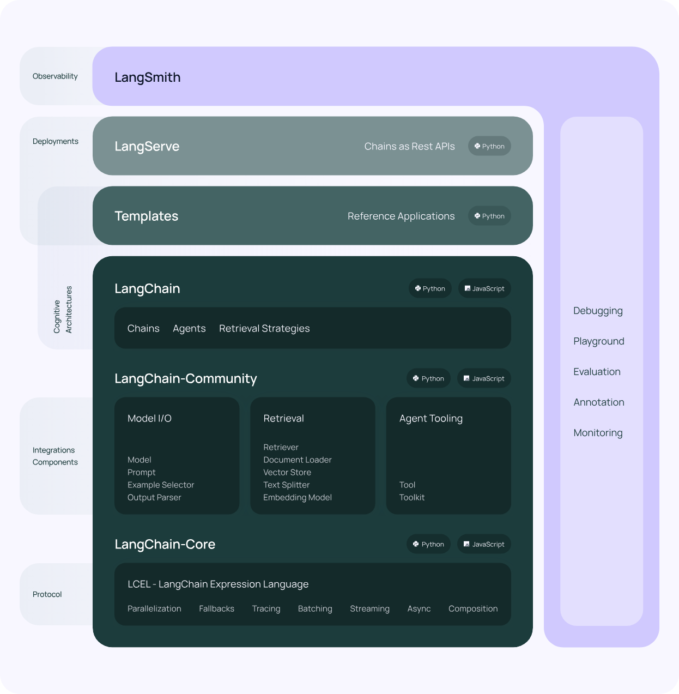

# langchain-mastery

This project demonstrates how to leverage Linkedin's search

## Technologies Used

- Linkedin Search
- Fullstack development
- SerpAPI(Google Search API)
- Prespeo(LinkedIn Email Finder & Data API)
- LangChain
- Flask API

## Environment Variables

To run this project, you will need to add the following environment variables to your .env file

`PYTHONPATH=/{YOUR_PATH_TO_PROJECT}/langchain-mastery`

`OPENAI_API_KEY`

`PROSPEO_API_KEY`

`SERPAPI_API_KEY`

(Option)`PROXYCURL_API_KEY`

## LangChain



1. **Search Result Scraping with SerpAPI**

SerpAPI allows you to efficiently locate desired profiles by scraping Google Search results within the project.

2. **Enhanced Precision with Agent**

Agent's advanced search algorithms refine SerpAPI results, saving time and effort by filtering out irrelevant profiles and prioritizing highly relevant profiles matching your criteria.

## Getting Started

Clone the project repository

```bash
git clone https://github.com/milhaud1201/langchain-mastery.git
```

Go to the project directory

```bash
cd langchain-mastery
```

Install from Pipenv

```bash
pip install pipenv
```

Install from Pipfile

```bash
pipenv install
```

Next, activate the Pipenv shell

```bash
pipenv shell
python --version
```

Start the flask server

```bash
pipenv run app.py
```

## Running Tests

To run tests, run the following command

```bash
pipenv run pytest .
```
